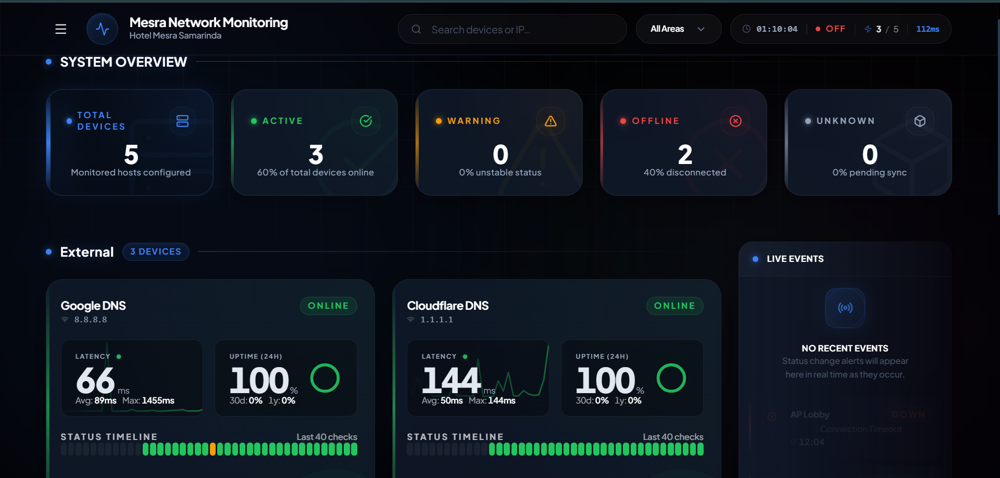
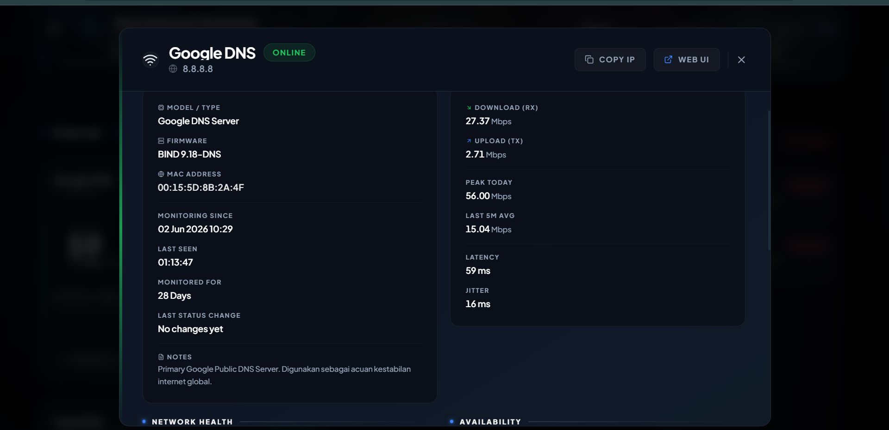
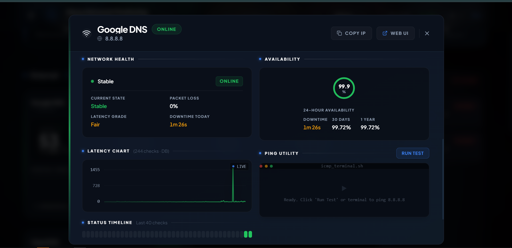
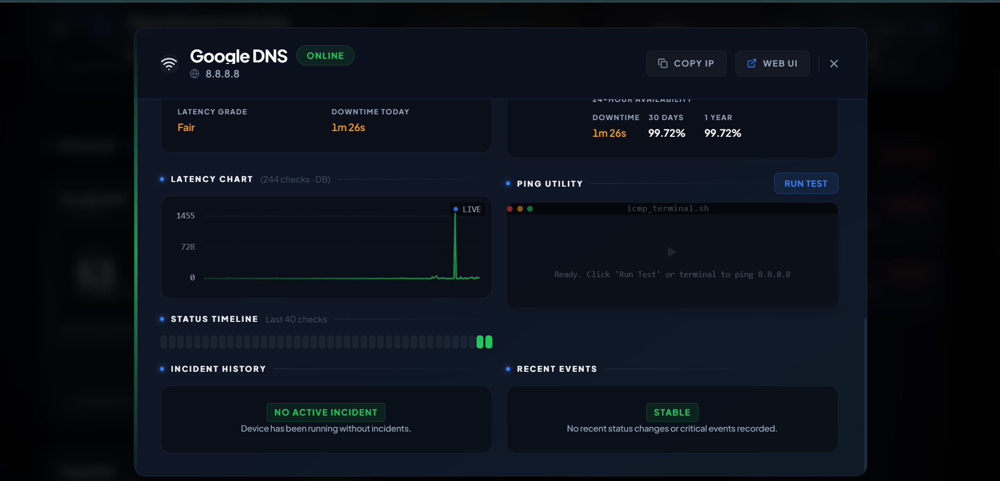
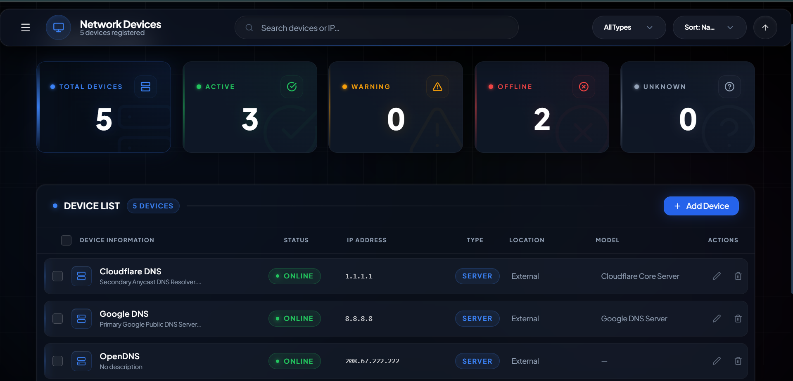
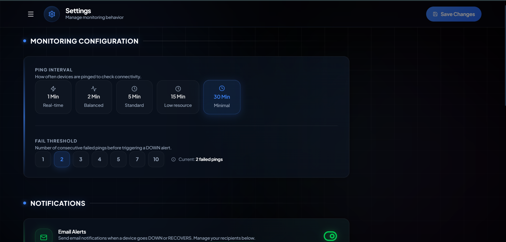
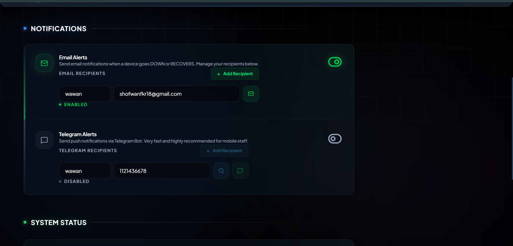
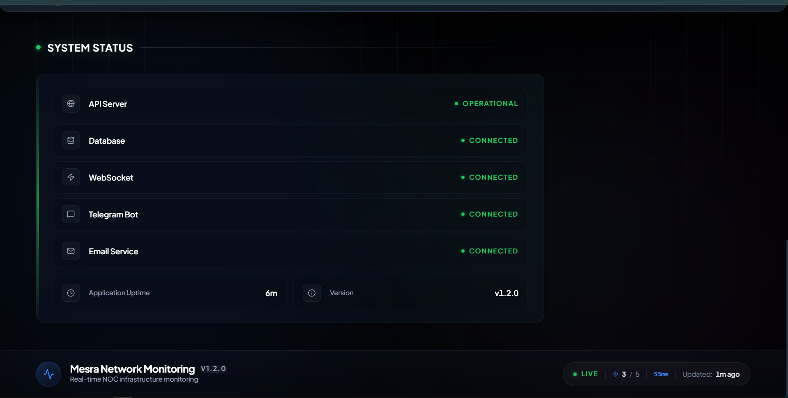

# 🌐 Mesra Network Monitoring

Mesra Network Monitoring adalah aplikasi monitoring jaringan yang dikembangkan untuk membantu tim IT Hotel Mesra Samarinda memantau kondisi perangkat jaringan secara real-time.

Aplikasi ini memonitor Router, Switch, Access Point, dan Server menggunakan ICMP Ping, kemudian menampilkan status perangkat melalui dashboard berbasis web. Selain itu, sistem juga mendukung notifikasi Telegram dan Email ketika perangkat mengalami gangguan maupun kembali normal.

Project ini dibangun menggunakan **NestJS**, **PostgreSQL**, **React**, **Socket.IO**, dan **Tailwind CSS**.

---

## 🛠️ Tech Stack

| Komponen      | Teknologi                             |
| ------------- | ------------------------------------- |
| Backend       | NestJS, TypeORM, PostgreSQL           |
| Frontend      | React, Vite, TypeScript, Tailwind CSS |
| Realtime      | Socket.IO                             |
| Monitoring    | ICMP Ping                             |
| Notifications | Telegram Bot API, Nodemailer          |

---

## 📁 Struktur Project

```text
PROJECT-MESRA-Monitoring/
├── backend/
│   ├── src/
│   │   ├── alert/          # Service Telegram & Email
│   │   ├── database/       # Entity, migrations, seeds
│   │   ├── device/         # CRUD perangkat
│   │   ├── history/        # Histori ping & event
│   │   ├── monitoring/     # Scheduler, PingService, Gateway
│   │   └── settings/       # Service & controller pengaturan
│   └── package.json
│
├── frontend/
│   ├── src/
│   │   ├── components/
│   │   │   ├── dashboard/  # DeviceCard, DeviceDetailPanel, EventPanel, PingTestTerminal
│   │   │   ├── layout/     # AppLayout, Sidebar, Footer
│   │   │   └── ui/         # CustomSelect, Sparkline, StatusTimeline, dsb.
│   │   ├── context/        # MonitoringContext (state management realtime)
│   │   ├── pages/          # Settings, DeviceManagement
│   │   ├── types/          # TypeScript interfaces
│   │   └── utils/          # Helper functions (network, formatter, dsb.)
│   └── package.json
│
├── .env.example
├── INSTALL.md
└── README.md
```

---

## 🚀 Installation

Petunjuk instalasi tersedia pada file **[INSTALL.md](./INSTALL.md)**.

Silakan ikuti langkah-langkah di sana untuk menjalankan aplikasi pada lingkungan development maupun production.

---

## 📖 Panduan Penggunaan Aplikasi

Berikut adalah panduan lengkap untuk setiap fitur yang tersedia di dalam aplikasi Mesra Network Monitoring.

---

### 📍 Navigasi Utama — Sidebar

Aplikasi memiliki sidebar navigasi di sisi kiri yang dapat dibuka/ditutup melalui tombol **☰ (hamburger menu)** di pojok kiri atas header. Sidebar menampilkan tiga menu utama:

| Menu                  | Fungsi                                                           |
| --------------------- | ---------------------------------------------------------------- |
| **Dashboard**         | Halaman utama untuk monitoring real-time semua perangkat         |
| **Device Management** | Halaman untuk menambah, mengedit, dan menghapus perangkat        |
| **Settings**          | Halaman konfigurasi interval ping, notifikasi, dan status sistem |

> **Tips:** Sidebar akan otomatis menampilkan halaman aktif dengan indikator visual. Klik pada logo **Mesra Network Monitoring** di header untuk kembali ke Dashboard.

---

### 📊 Halaman Dashboard

Dashboard adalah halaman utama yang menampilkan kondisi seluruh perangkat jaringan secara real-time. Semua data di halaman ini diperbarui secara otomatis melalui WebSocket tanpa perlu me-refresh browser.

#### 1. Header & Status Bar

Di bagian atas dashboard terdapat:

- **Indikator koneksi real-time** — menunjukkan apakah browser terhubung ke backend melalui WebSocket.
- **Jam real-time** — menampilkan waktu saat ini yang diperbarui setiap detik.
- **Statistik ringkasan** — empat kartu metrik yang menunjukkan:
  - **Total Devices** — jumlah seluruh perangkat yang terdaftar.
  - **Online** — jumlah perangkat yang merespon ping dengan normal.
  - **Warning** — jumlah perangkat yang merespon tetapi latency-nya tinggi (> 150ms).
  - **Offline** — jumlah perangkat yang tidak merespon ping sama sekali.

#### 2. Filter & Pencarian

Dashboard menyediakan beberapa fitur filter untuk mempermudah pencarian perangkat:

- **Search Bar** — ketik nama perangkat atau alamat IP untuk mencari perangkat tertentu. Pencarian bersifat real-time (hasil langsung muncul saat mengetik).
- **Filter Status** — dropdown untuk menampilkan perangkat berdasarkan status: `All`, `Online`, `Warning`, `Offline`, atau `Unknown`.
- **Filter Lokasi** — dropdown untuk menampilkan perangkat berdasarkan lokasi (misalnya: Lantai 1, Lantai 2, Server Room, dsb.). Daftar lokasi otomatis diambil dari data perangkat yang sudah terdaftar.

> **Tips:** Kombinasikan beberapa filter sekaligus. Contoh: pilih status `Offline` dan lokasi `Lantai 3` untuk melihat perangkat mana saja yang sedang bermasalah di lantai tersebut.

#### 3. Device Cards

Setiap perangkat ditampilkan sebagai sebuah kartu (card) yang berisi informasi ringkas:

- **Ikon tipe perangkat** — menampilkan ikon sesuai jenis perangkat (AP, Router, atau Server).
- **Nama & IP Address** — identitas perangkat.
- **Status indikator** — garis berwarna di sisi kiri kartu:
  - 🟢 **Hijau** = Online
  - 🟡 **Kuning** = Warning (latency tinggi)
  - 🔴 **Merah** = Offline
  - ⚪ **Abu-abu** = Unknown (belum ada data)
- **Latency** — waktu respon ping terakhir dalam milidetik (ms).
- **Sparkline Chart** — grafik mini yang menampilkan tren latency dari beberapa ping terakhir.
- **Status Timeline** — deretan titik-titik kecil di bagian bawah kartu yang menunjukkan riwayat status (hijau/merah) dari beberapa siklus ping sebelumnya.
- **Uptime persentase** — menampilkan uptime 30 hari dan 1 tahun yang dihitung dari data historis di database.

Perangkat dikelompokkan berdasarkan **lokasi** dengan header lokasi di atas setiap grup.

> **Tips:** Klik pada kartu perangkat untuk membuka **Device Detail Panel** yang menampilkan informasi lebih lengkap.

#### 4. Live Events Panel

Di sisi kanan dashboard terdapat panel **Live Events** yang menampilkan log kejadian secara real-time:

- **DOWN** — muncul ketika suatu perangkat terdeteksi offline setelah melewati batas fail threshold.
- **RECOVERED** — muncul ketika perangkat yang sebelumnya offline kembali merespon ping.
- **ALERT_SENT** — notifikasi bahwa alert (Telegram/Email) telah berhasil dikirim.

Setiap event menampilkan:

- Nama perangkat yang terdampak
- Tipe event (DOWN / RECOVERED)
- Waktu kejadian
- Pesan detail

Fitur yang tersedia pada panel ini:

- **Klik event** — mengklik event akan langsung membuka Device Detail Panel dari perangkat terkait.
- **Hapus individual** — klik tombol ✕ pada event untuk menghapusnya.
- **Clear All** — tombol "Clear" di header panel untuk menghapus seluruh event sekaligus.

#### 5. Snackbar Notification

Setiap kali ada event DOWN atau RECOVERED, sebuah snackbar (notifikasi kecil) akan muncul di bagian bawah layar secara sementara selama 5 detik. Snackbar ini memberikan informasi cepat tanpa mengganggu aktivitas monitoring. Snackbar dapat di-dismiss secara manual dengan mengklik tombol close.

---

### 🔍 Device Detail Panel

Ketika Anda mengklik salah satu Device Card di Dashboard, panel detail akan muncul sebagai overlay di sisi kanan layar. Panel ini berisi informasi mendalam tentang perangkat yang dipilih.

#### 1. Informasi Perangkat

Bagian atas panel menampilkan:

- **Nama perangkat** dan **tipe** (AP / Router / Server)
- **IP Address** — dengan tombol copy untuk menyalin alamat IP ke clipboard
- **Lokasi** perangkat
- **Model**, **Firmware**, dan **MAC Address** (jika diisi saat pendaftaran perangkat)
- **Deskripsi** perangkat

#### 2. Status & Health Badge

- **Status saat ini** — Online, Offline, Warning, atau Unknown
- **Health Badge** — penilaian kesehatan perangkat berdasarkan kombinasi metrik:
  - **Healthy** — Uptime tinggi, latency rendah, tanpa packet loss
  - **Stable** — Performa normal dengan variasi kecil
  - **Warning / Degraded** — Packet loss terdeteksi, jitter tinggi, atau latency buruk
  - **Critical** — Perangkat offline

#### 3. Metrik Jaringan

Panel menampilkan metrik real-time berikut:

| Metrik               | Penjelasan                                                                      |
| -------------------- | ------------------------------------------------------------------------------- |
| **Current Latency**  | Latency ping terakhir dalam milidetik                                           |
| **Average Latency**  | Rata-rata latency dari seluruh histori ping yang tersedia                       |
| **Jitter**           | Variasi latency antar-ping (semakin rendah semakin stabil)                      |
| **Packet Loss**      | Persentase ping yang gagal dari total percobaan                                 |
| **Uptime (Session)** | Persentase waktu online selama sesi monitoring aktif                            |
| **Uptime (30 Days)** | Persentase uptime historis selama 30 hari terakhir dari database                |
| **Uptime (1 Year)**  | Persentase uptime historis selama 1 tahun terakhir dari database                |
| **Latency Grade**    | Penilaian kualitas latency: Excellent (< 50ms), Fair (50–150ms), Poor (> 150ms) |

#### 4. Latency Sparkline Chart

Grafik garis interaktif yang menampilkan tren latency perangkat dari data ping yang tersedia. Data diambil dari histori database (24 jam terakhir) jika tersedia, atau dari data sesi real-time.

#### 5. Status Timeline

Deretan visual yang menampilkan riwayat status perangkat (online/offline/warning) dari beberapa siklus ping terakhir. Setiap titik merepresentasikan satu siklus ping.

#### 6. Informasi Monitoring

- **Monitoring Since** — tanggal dan waktu perangkat pertama kali didaftarkan.
- **Monitored For** — durasi total perangkat telah dimonitor (dalam hari).
- **Last Seen** — waktu terakhir ping berhasil diterima.
- **Last Status Change** — berapa lama sejak perubahan status terakhir terjadi.
- **Offline Since** — (jika offline) waktu perangkat mulai tidak merespon.
- **Offline Duration** — (jika offline) durasi downtime yang sedang berlangsung.
- **Downtime Today** — estimasi total downtime pada hari ini.

#### 7. Bandwidth Traffic (Simulasi)

Panel menampilkan estimasi traffic bandwidth (RX/TX) secara simulasi untuk memberikan gambaran visual mengenai aktivitas perangkat. Data ini berfluktuasi secara real-time saat perangkat dalam status online, dan akan menunjukkan 0 saat offline.

#### 8. Event Log Perangkat

Daftar event historis khusus perangkat ini, termasuk:

- Waktu kejadian
- Tipe event (DOWN, RECOVERED, ALERT_SENT, MANUAL_TEST)
- Pesan detail

Data diambil dari database dan digabungkan dengan event real-time dari WebSocket.

#### 9. Ping Test Terminal

Fitur built-in yang memungkinkan Anda menjalankan ping test langsung dari browser tanpa perlu membuka Command Prompt / Terminal:

1. Klik tombol **"Run Test"** atau klik area terminal.
2. Sistem akan mengirimkan 5 paket ICMP ke perangkat target.
3. Setiap baris output ditampilkan secara bertahap seperti terminal asli, termasuk:
   - Respon per paket dengan latency
   - Atau `Request timeout` jika perangkat tidak merespon
4. Setelah selesai, ringkasan statistik akan ditampilkan:
   - Jumlah paket dikirim vs diterima
   - Persentase packet loss
   - Min / Avg / Max / Stddev latency
5. Jika 100% packet loss, sistem akan otomatis mencatat event **MANUAL_TEST** ke log.
6. Klik **"Run Again"** untuk mengulangi test.

> **Tips:** Fitur ini sangat berguna untuk troubleshooting cepat — memverifikasi apakah perangkat benar-benar offline atau ada masalah intermittent tanpa harus meninggalkan dashboard.

---

### 🖧 Halaman Device Management

Halaman ini digunakan untuk mengelola daftar perangkat yang dimonitor. Akses melalui sidebar: **Device Management**.

#### 1. Daftar Perangkat

Semua perangkat yang terdaftar ditampilkan dalam bentuk tabel/kartu dengan informasi:

- Nama perangkat
- IP Address
- Tipe (AP / Router / Server)
- Lokasi
- Status koneksi saat ini (Online / Offline / Warning / Unknown)
- Model, Firmware, MAC Address (jika diisi)

#### 2. Pencarian & Filter

- **Search** — cari perangkat berdasarkan nama, IP, model, atau lokasi.
- **Filter Tipe** — tampilkan perangkat berdasarkan tipe: All, AP, Router, atau Server.
- **Filter Lokasi** — tampilkan perangkat berdasarkan lokasi tertentu.
- **Sortir** — urutkan perangkat berdasarkan nama, IP, tipe, atau lokasi (ascending/descending).

#### 3. Menambah Perangkat Baru

1. Klik tombol **"+ Add Device"** di bagian atas halaman.
2. Modal form akan muncul dengan field berikut:

| Field           | Keterangan                                                            | Wajib |
| --------------- | --------------------------------------------------------------------- | ----- |
| **Name**        | Nama perangkat (contoh: AP Lobby Lt.1)                                | ✅    |
| **IP Address**  | Alamat IP perangkat yang akan di-ping                                 | ✅    |
| **Type**        | Jenis perangkat: AP, Router, atau Server                              | ✅    |
| **Location**    | Lokasi fisik perangkat (bisa dipilih dari yang ada atau membuat baru) | ✅    |
| **Model**       | Model/seri perangkat (opsional)                                       | ❌    |
| **MAC Address** | Alamat MAC perangkat (opsional)                                       | ❌    |
| **Firmware**    | Versi firmware perangkat (opsional)                                   | ❌    |
| **Description** | Catatan atau keterangan tambahan (opsional)                           | ❌    |

3. Klik **"Create Device"** untuk menyimpan.
4. Perangkat baru akan langsung muncul di Dashboard dan mulai dimonitor pada siklus ping berikutnya **tanpa perlu restart server**.

> **Tips:** Field **Location**, **Model**, dan **Firmware** mendukung **Creatable Select** — Anda bisa memilih dari daftar yang sudah ada atau langsung mengetik nilai baru.

#### 4. Mengedit Perangkat

1. Klik ikon **✏️ (Edit)** pada perangkat yang ingin diubah.
2. Form yang sama dengan saat menambah perangkat akan muncul, namun sudah terisi data saat ini.
3. Ubah field yang diperlukan, lalu klik **"Update Device"**.

#### 5. Menghapus Perangkat

1. Klik ikon **🗑️ (Delete)** pada perangkat yang ingin dihapus.
2. Konfirmasi penghapusan akan muncul.
3. Setelah dihapus, perangkat tidak akan lagi dimonitor dan akan hilang dari Dashboard.

> **Peringatan:** Penghapusan perangkat bersifat **permanen**. Pastikan perangkat memang tidak lagi perlu dimonitor sebelum menghapusnya.

---

### ⚙️ Halaman Settings

Halaman konfigurasi untuk mengatur perilaku monitoring dan notifikasi. Akses melalui sidebar: **Settings**. Halaman ini memiliki fitur **Unsaved Changes Detection** — jika Anda mengubah pengaturan lalu mencoba berpindah halaman tanpa menyimpan, akan muncul modal konfirmasi.

#### 1. Monitoring Configuration

##### Ping Interval

Mengatur seberapa sering sistem mengirimkan ICMP ping ke semua perangkat. Pilihan yang tersedia:

| Interval     | Keterangan                                                  |
| ------------ | ----------------------------------------------------------- |
| **1 Menit**  | Monitoring real-time, cocok untuk infrastruktur kritikal    |
| **2 Menit**  | Interval seimbang antara kecepatan deteksi dan beban server |
| **5 Menit**  | Interval standar untuk monitoring umum                      |
| **15 Menit** | Beban server rendah, cocok untuk perangkat non-kritikal     |
| **30 Menit** | Interval minimal, hanya untuk keperluan basic monitoring    |

Klik pada salah satu kartu interval untuk memilih. Interval yang aktif akan ditandai dengan highlight biru. Perubahan **langsung berlaku** setelah disimpan — scheduler backend akan otomatis restart dengan interval baru tanpa perlu restart server.

##### Fail Threshold

Mengatur berapa kali ping harus gagal secara berturut-turut sebelum sistem menganggap perangkat sebagai **DOWN** dan mengirim alert. Pilihan yang tersedia: **1, 2, 3, 4, 5, 7, 10**.

Contoh: Jika threshold diset **3**, maka perangkat harus gagal merespon ping **3 kali berturut-turut** sebelum dianggap DOWN. Ini berguna untuk menghindari **false alarm** akibat packet loss sesaat.

> **Tips:** Gunakan threshold lebih tinggi (5–10) untuk jaringan yang sering mengalami fluktuasi sementara, dan threshold rendah (1–2) untuk perangkat kritikal yang perlu deteksi cepat.

#### 2. Notifications

##### Email Alerts

Untuk mengaktifkan notifikasi email:

1. Klik toggle **Email Alerts** ke posisi **ON**.
2. Tambahkan penerima email:
   - Klik **"+ Add Recipient"** untuk menambah penerima baru.
   - Isi **Label** (nama/identitas penerima) dan **Email Address**.
   - Anda dapat menambahkan **beberapa penerima** sekaligus.
3. Untuk menghapus penerima, klik tombol ✕ di samping penerima.
4. Klik **"Send Test Email"** untuk mengirim email test ke alamat tertentu dan memverifikasi bahwa konfigurasi SMTP sudah benar.

Sistem akan mengirim email saat terjadi:

- **Device DOWN** — berisi informasi perangkat, waktu kejadian, dan jumlah ping gagal.
- **Device RECOVERED** — berisi informasi perangkat dan waktu pemulihan.

> **Catatan:** Konfigurasi SMTP (MAIL_USER dan MAIL_PASS) harus sudah diatur di file `.env` backend. Gunakan **App Password** Gmail, bukan password biasa.

##### Telegram Alerts

Untuk mengaktifkan notifikasi Telegram:

1. Klik toggle **Telegram Alerts** ke posisi **ON**.
2. Tambahkan penerima Telegram:
   - Klik **"+ Add Recipient"** untuk menambah penerima baru.
   - Isi **Label** (nama/identitas penerima) dan **Chat ID**.
3. Cara mendapatkan Chat ID:
   - **Auto Detect** — klik tombol **"Detect"** pada penerima yang ingin diisi. Sebelumnya, kirim pesan `/chatid` ke bot Telegram Anda. Sistem akan otomatis mendeteksi Chat ID dari pesan terakhir yang diterima bot.
   - **Manual** — masukkan Chat ID secara langsung jika sudah diketahui.
4. Klik **"Test"** untuk mengirim pesan test ke Chat ID tertentu dan memverifikasi bahwa bot sudah terhubung dengan benar.

Sistem akan mengirim pesan Telegram saat terjadi event DOWN dan RECOVERED dengan format yang sama seperti email.

> **Catatan:** TELEGRAM_BOT_TOKEN harus sudah diatur di file `.env` backend. Buat bot melalui [@BotFather](https://t.me/BotFather) di Telegram.

#### 3. System Status

Di bagian bawah halaman Settings terdapat panel **System Status** yang menampilkan kondisi layanan internal secara real-time (di-refresh otomatis setiap 30 detik):

| Layanan           | Indikator                                                  |
| ----------------- | ---------------------------------------------------------- |
| **API Server**    | ✅ Operational — selalu aktif selama backend berjalan      |
| **Database**      | 🟢 Connected / 🔴 Disconnected — status koneksi PostgreSQL |
| **WebSocket**     | 🟢 Connected — status koneksi Socket.IO                    |
| **Telegram Bot**  | 🟢 Connected / 🔴 Failed / ⚪ Not Configured               |
| **Email Service** | 🟢 Connected / 🔴 Failed / ⚪ Not Configured               |

Informasi tambahan:

- **Uptime** — berapa lama backend telah berjalan sejak terakhir restart.
- **Version** — versi aplikasi saat ini.

#### 4. Menyimpan Pengaturan

- Setelah melakukan perubahan, klik tombol **"Save Settings"** yang muncul di bagian atas halaman (floating save bar).
- Tombol save hanya muncul ketika ada perubahan yang belum disimpan (**dirty state**).
- Tombol **"Discard"** tersedia untuk membatalkan semua perubahan dan mengembalikan ke pengaturan sebelumnya.
- Setelah berhasil disimpan, snackbar sukses akan muncul.

---

### 🔔 Sistem Alerting — Alur Kerja

Berikut adalah alur lengkap bagaimana sistem mendeteksi gangguan dan mengirim notifikasi:

```
1. Scheduler mengirim ICMP Ping ke semua perangkat sesuai Ping Interval
                    ↓
2. Jika perangkat gagal merespon, fail counter bertambah +1
                    ↓
3. Jika fail counter mencapai Fail Threshold:
   → Status perangkat berubah menjadi DOWN
   → Event "DOWN" dicatat ke database
   → Event "DOWN" dikirim ke frontend via WebSocket
   → Jika Email Alerts aktif → kirim email ke semua penerima
   → Jika Telegram Alerts aktif → kirim pesan ke semua Chat ID
                    ↓
4. Jika perangkat kembali merespon:
   → Status perangkat berubah menjadi RECOVERED
   → Fail counter di-reset ke 0
   → Event "RECOVERED" dicatat dan dikirim
   → Notifikasi recovery dikirim via Email/Telegram (jika aktif)
```

---

### 💡 Tips Penggunaan

1. **Pertama kali setup:** Tambahkan perangkat melalui Device Management, lalu atur konfigurasi di Settings. Perangkat akan langsung mulai dimonitor.

2. **Monitoring efektif:** Gunakan kombinasi filter di Dashboard untuk fokus pada area atau jenis perangkat tertentu. Biarkan tab browser tetap terbuka — data akan terus diperbarui secara otomatis.

3. **Troubleshooting cepat:** Saat menerima alert, klik perangkat yang bermasalah di Dashboard, lalu gunakan **Ping Test Terminal** untuk memverifikasi kondisi perangkat secara langsung.

4. **Hindari false alarm:** Atur **Fail Threshold** ke 3 atau lebih tinggi agar sistem tidak langsung mengirim alert karena packet loss sesaat.

5. **Multi-channel notification:** Aktifkan **Telegram dan Email** sekaligus untuk redundansi notifikasi. Telegram untuk respon cepat, Email untuk dokumentasi.

6. **Cek System Status:** Jika notifikasi tidak terkirim, periksa panel System Status di Settings untuk memastikan semua layanan (Telegram Bot, Email Service) terhubung dengan benar.

---

## 📸 Screenshots

### Dashboard

| Dashboard |
| --- |
|  |
| **Penjelasan:** Dashboard utama untuk memantau seluruh perangkat jaringan secara real-time. Dari halaman ini pengguna dapat melihat ringkasan status perangkat, mencari perangkat tertentu, memantau perubahan latency, serta melihat aktivitas terbaru yang muncul secara langsung pada panel Live Events. |

---

### Device Detail Panel

| Device Info & Traffic Stat | Network Health, Avail, Latency Chart, Ping Util & Status Time |
| --- | --- |
|  |  |
| **Penjelasan:** Menampilkan informasi utama perangkat seperti alamat IP, MAC Address, model, firmware, serta statistik traffic upload dan download. Seluruh informasi dasar perangkat tersedia dalam satu tampilan sehingga lebih mudah saat melakukan identifikasi. | **Penjelasan:** Berisi ringkasan kondisi perangkat, availability, grafik latency, status timeline, serta terminal ping yang dapat digunakan untuk melakukan pengujian koneksi langsung dari aplikasi. |

| Incident & Events |
| --- |
|  |
| **Penjelasan:** Menampilkan riwayat gangguan yang pernah terjadi pada perangkat, mulai dari waktu perangkat offline, durasi downtime, penyebab gangguan, hingga daftar event seperti DOWN, RECOVERY, ALERT SENT, dan MANUAL TEST. |

---

### Device Management

| Device Management |
| --- |
|  |
| **Penjelasan:** Halaman untuk mengelola seluruh perangkat yang dipantau oleh sistem. Pengguna dapat menambahkan perangkat baru, mengubah informasi perangkat, maupun menghapus perangkat yang sudah tidak digunakan. |

---

### Settings

| General Settings | Notification Settings |
| --- | --- |
|  |  |
| **Penjelasan:** Digunakan untuk mengatur parameter utama proses monitoring, seperti interval pengecekan perangkat dan Fail Threshold agar sistem tidak mudah mengirim false alarm saat terjadi gangguan singkat. | **Penjelasan:** Halaman konfigurasi notifikasi Email dan Telegram. Pengguna dapat menambahkan penerima alert, menghubungkan Telegram Bot, serta mengaktifkan atau menonaktifkan layanan notifikasi sesuai kebutuhan. |

| System Status |
| --- |
|  |
| **Penjelasan:** Menampilkan kondisi seluruh layanan internal aplikasi, seperti API Server, Database, WebSocket, Telegram Bot, dan Email Service sehingga pengguna dapat memastikan sistem monitoring berjalan dengan baik. |
